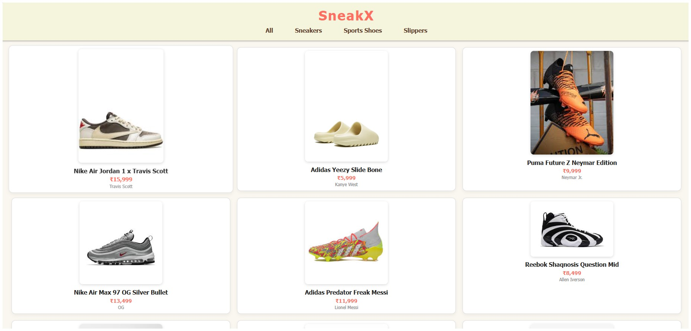

# 👟 Sneak X – Sneaker E-Commerce Frontend

Sneak X is a fully responsive and beginner-friendly sneaker store interface built using **HTML, CSS, and  JavaScript**. It displays a curated collection of sneakers, sports shoes, and slippers in a clean and minimal layout inspired by real-world e-commerce sites.

---

## 🚀 Features

- 🖼️ High-quality sneaker and footwear product cards  
- 🧭 Category filtering: Sneakers, Sports Shoes, and Slippers   
- 📱 Fully responsive layout for mobile and desktop  
- 🎨 Custom color palette: black, white, beige, coral, and blue  
- ❤️ Footer message: “Created with love by Aditya”

---

## 📁 Project Structure

---

## 🧑‍💻 Tech Stack

- **HTML5** – semantic structure  
- **CSS3** – responsive grid layout and styling  
- **JavaScript (Vanilla)** – DOM manipulation, modal logic, cart simulation  

---

## 📌 Note

This project was built purely for **frontend learning purposes** and does **not include backend or payment integration**.

---

## 📸 Preview

 <!-- Add a preview screenshot here if available -->

---

## 🙌 Author

**Aditya Kumar Jha**  
_Fresher, Computer Science & Engineering_

> “Created with love by Aditya” 💙

---

